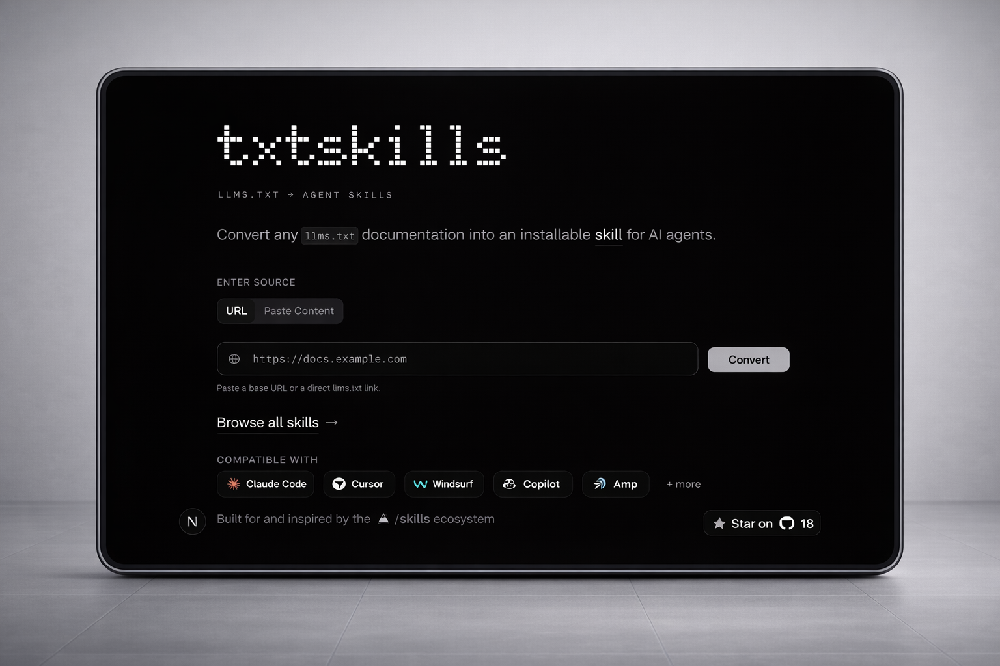

# txtskills

Convert any llms.txt documentation into an installable skill for AI agents.

<div align="center">
  
</div>

Generated skills are saved to [hk-vk/skills](https://github.com/hk-vk/skills)

---

## What This Repo Contains

- `apps/web`: Next.js app (`txtskills.hari.works`)
- `packages/cli`: `txtskills` CLI to list/search/install skills
- `packages/ui`: shared UI components

## Getting Started

```bash
pnpm dev
```

## Useful Commands

```bash
pnpm dev:web
pnpm build:web
pnpm deploy:web
```

## CLI

Install:

```bash
npx txtskills add <skill-name>
```

Browse:

```bash
npx txtskills list
```

## Links

- Website: https://txtskills.hari.works
- Skills directory: https://txtskills.hari.works/skills
- Skills registry: https://github.com/hk-vk/skills
